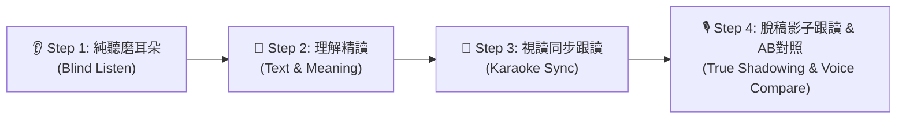

# 🎙️ 影子跟讀訓練室（Shadowing Studio）實作計畫

本計畫旨在為「雙語探險學院（[learn.html](file:///d:/antigravity/017_小朋友APP/learn.html)）」新增專業級的**影子跟讀（Shadowing）學習模組**。
依據雙方協作分工：由**主架構師（Antigravity）**制定詳細架構、故事語音資料庫與代碼藍圖，交由 **OpenCode** 進行具體代碼落實，再由主架構師驗收審核，最後由您在瀏覽器端檢驗實際學習體驗。

---

## 📚 一、 影子跟讀法（Shadowing Technique）科學教學設計

影子跟讀源於「同步口譯」訓練法，強調**耳朵聽到聲音的瞬間，只延遲 0.2～0.5 秒，嘴巴像影子般緊隨其後同步模仿**。其核心不是逐字翻譯，而是透過模仿母語者的**語調（Intonation）、重音（Stress）、連音（Connected Speech）、停頓與節奏（Cadence）**，打通「耳朵聽覺 → 大腦處理 → 口腔肌肉記憶」的高速迴路。

本系統依據權威影子跟讀指南，落實標準**「四階段階梯訓練流程」**：



1. **Step 1: 👂 純聽磨耳朵（Blind Listen）**：
   - 預設遮蔽文本，播放動態聲波動畫。
   - 專注捕捉母語者的語速、情緒、抑揚頓挫與停頓點，避免眼睛依賴文字干擾聽覺。
2. **Step 2: 📖 理解精讀（Text & Meaning）**：
   - 展開雙語對照文本、日語假名讀音與重點生字。
   - 標示語調起伏、連音點（Linking）與停頓標記（/），確保發音前已完全理解意境。
3. **Step 3: 📑 視讀同步跟讀（Karaoke Sync Reading）**：
   - 支援 0.8x（慢速咬字）、1.0x（原速）、1.2x（挑戰）三段調速。
   - 卡拉 OK 式逐句/逐詞高亮，眼睛看稿、嘴巴同步朗讀，建立基礎肌肉發音記憶。
4. **Step 4: 🎙️ 脫稿影子跟讀 + 雙軌錄音 AB 對照（True Shadowing & Voice Contrast）**：
   - 文字半透明或全遮蔽，僅提供「影子節拍指示器（Shadowing Guide Metronome）」。
   - 母語音訊播放延遲 0.3 秒啟動同步錄音，引導使用者緊咬跟隨。
   - 錄音結束後提供 **雙軌對比播放器**：學習者可一鍵切換「🔊 聽原音」與「🎧 聽我的錄音」，即時察覺咬字落差、吞音與語調問題。
   - 整合 Web Speech Recognition 給予流暢度與精確度星級評分（⭐ 1~3 星），累計經驗解鎖成就。

---

## 📖 二、 內建故事與語音片段資料庫（Story Library）

針對**小朋友模式（Kids Mode）**與**大人模式（Adult Mode）**各精選英日語趣味小故事與短演講片段：

### 1. 小朋友模式（Kids Mode - 寓言童話與童趣節奏）
*   **英語（English）**：
    1. **《The Little Red Hen》（勤勞的小紅母雞）**：
       - 經典重複句型：「"Who will help me plant the wheat?" "Not I!" said the duck.」
       - 特點：節奏鮮明，極適合幼兒與初學者訓練語調與反覆提問語氣。
    2. **《The Tortoise and the Hare》（龜兔賽跑）**：
       - 特點：涵蓋「驕傲快速」與「堅定緩慢」兩種不同情緒的語音對比。
    3. **《The Three Little Pigs》（三隻小豬）**：
       - 特點：大野狼吹氣「I will huff, and I will puff!」富含爆破音與張力。
*   **日語（Japanese）**：
    1. **《おむすびころりん》（飯糰滾滾）**：
       - 特點：童謠式疊字「おむすび ころりん すっとんとん♪」，韻律感極強。
    2. **《ももたろう》（桃太郎）**：
       - 特點：經典冒險故事，包含「どんぶらこ どんぶらこ」等擬聲擬態詞。
    3. **《うさぎとかめ》（兔子與烏龜）**：
       - 特點：短句明快，附假名讀音，適合日語初學者抓握平假名節奏。

### 2. 大人模式（Adult Mode - 思想短講、生活哲理與實用場景）
*   **英語（English）**：
    1. **《The 1% Compound Effect》（原子習慣：每天進步1%的複利力量）**：
       - 語境：TED Talk 式演講節奏，訓練思維停頓、重音強調與邏輯斷句。
    2. **《The Art of Active Listening》（職場溝通：傾聽的藝術）**：
       - 語境：專業職場與商務對話，訓練沉穩、清晰的中速商務發音。
    3. **《A Midnight Diner in Tokyo》（城市漫遊：深夜食堂的片刻溫暖）**：
       - 語境：感性散文故事，訓練連貫流暢的語流（Connected Speech）與輕柔音調。
*   **日語（Japanese）**：
    1. **《一期一会の心》（一期一會的待人哲學）**：
       - 語境：日本文化與茶道精髓，訓練典雅的敬語節奏與氣息控制。
    2. **《日本の朝ごはんと四季》（四季風物詩：傳統朝食的滋味）**：
       - 語境：NHK 紀錄片旁白風格，語音平穩純正、咬字精準。
    3. **《駅のアナウンスと日常》（電車廣播與都會節奏）**：
       - 語境：實戰生活日常，訓練快速清晰的常用生活語句。

---

## 🛠️ 三、 技術架構設計

### 1. 檔案位置
*   主檔案：`d:\antigravity\017_小朋友APP\learn.html`
*   Service Worker 離線快取更新：`d:\antigravity\017_小朋友APP\sw.js`（升級至 v20）

### 2. 介面層（UI Layer）
*   **頂部導航列新增 Tab**：
    ```html
    <button class="tab-btn" data-tab="shadowing">
      <span>🎙️</span> <span id="tabShadowingText">影子跟讀</span>
    </button>
    ```
*   **主題樣式支援**：
    - `body.mode-kids`：粉彩柔和卡片、氣泡波浪、卡通化聲波指示器、果凍感按鈕。
    - `body.mode-adult`：深夜科技深灰藍（`#0f172a`）、極簡精確波形進度條、專業雙軌音訊對照卡。

### 3. 控制器層（ShadowingEngine JS）
*   **音訊合成與調速引擎**：
    - 採用 `window.speechSynthesis` 配合特定語言代碼（`en-US` / `ja-JP`），支援 `rate`（0.75x ~ 1.25x）與 `pitch` 微調。
    - 同步支援載入外接 `.mp3` / Web Audio 音訊。
*   **卡拉 OK 視覺同步控制器（Karaoke Highlighting Controller）**：
    - 依據句子時間戳與字數估算比例，動態更新進度條與正在朗讀的文字高亮。
*   **雙軌錄音與 AB 播放器（Dual-Track Recorder & Compare）**：
    - 利用 `navigator.mediaDevices.getUserMedia` 與 `MediaRecorder` 錄製學習者音訊（Blob URL）。
    - 建立 `nativeAudio` vs `userAudio` 切換機制，可零延遲重播比對。
*   **語音評分模組**：
    - 利用 `webkitSpeechRecognition` 進行即時文字識別，採用 Levenshtein 距離計算精準度百分比（Accuracy%），回饋星級與鼓勵語句。

---

## 📋 四、 給 OpenCode 的執行指示書（OpenCode Execution Spec）

此段為直接提供給 OpenCode 執行之明確作業指令：

### 任務目標
在 `learn.html` 中新增第 5 個分頁 **`#tab-shadowing`（影子跟讀訓練室）**，並補齊對應的 CSS 樣式、JavaScript 邏輯與完整雙語故事資料集。

### 實作步驟細節

#### 步驟 1：導航列修改
在 `<nav class="nav-tabs">` 中，於情境對話（dialogue）按鈕旁加入：
```html
<button class="tab-btn" data-tab="shadowing">
  <span>🎙️</span> <span id="tabShadowingText">影子跟讀</span>
</button>
```

#### 步驟 2：加入 `#tab-shadowing` 主體結構
包含：
1. **故事選擇器列（Story Selector Bar）**：
   - 語言切換（🇬🇧 英語 / 🇯🇵 日語）
   - 故事下拉選單或滑動卡片（依當前小朋友/大人模式自動切換對應故事清單）
   - 語速調整按鈕組（0.8x 慢速 / 1.0x 標準 / 1.2x 挑戰）
2. **四階段導航標籤（Step Indicator）**：
   - `[1. 👂 純聽]` `[2. 📖 精讀]` `[3. 📑 視讀跟讀]` `[4. 🎙️ 脫稿影子+錄音]`
3. **主訓練互動展示舞台（Training Stage Card）**：
   - **聲波動畫區（Waveform Visualizer）**：播放時動態起伏的聲波條。
   - **文本展示區（Script Display Area）**：
     - 原文字句（支援大字體、音節停頓標記、日語振假名 `<ruby>`）。
     - 中文釋義（Step 1 與 Step 4 自動隱藏，可手動點擊眼睛圖示偷看）。
     - 重點發音提示（如連音 ‿ 、升降調 ↗↘）。
   - **卡拉 OK 行進進度條（Karaoke Bar）**。
4. **控制操作面板（Control Dock）**：
   - **播放母語者原音按鈕（Play / Pause）**。
   - **脫稿跟讀 + 錄音按鈕（Start Shadowing & Record）**：倒數 3、2、1 後播放原音，0.3 秒後開啟錄音。
   - **AB 對照切換列（錄音完成後淡入顯示）**：
     - `🔊 聽母語原音`
     - `🎧 聽我的錄音`
     - `🔄 重新挑戰`
   - **AI 評分與診斷卡（AI Feedback Pill）**：顯示流暢度、精準度百分比與星級獎勵。

#### 步驟 3：加入 CSS 樣式
包含：
- `.shadowing-container`、`.step-tabs`、`.step-tab-btn.active`
- `.sound-wave` 聲波 CSS 柱狀動畫（`@keyframes soundWaveAnim`）
- 卡拉 OK 高亮樣式 `.karaoke-highlight`
- 雙軌播放器 `.ab-compare-dock`
- 小朋友模式（粉嫩童趣）與大人模式（暗黑精準）的相應色系適配

#### 步驟 4：注入完整故事資料庫物件 `SHADOWING_DATA`
包含：
```javascript
const SHADOWING_DATA = {
  kids: {
    en: [ /* The Little Red Hen, The Tortoise and the Hare, The Three Little Pigs */ ],
    ja: [ /* おむすびころりん, ももたろう, うさぎとかめ */ ]
  },
  adult: {
    en: [ /* The 1% Compound Effect, The Art of Active Listening, A Midnight Diner in Tokyo */ ],
    ja: [ /* 一期一会の心, 日本の朝ごはんと四季, 駅のアナウンスと日常 */ ]
  }
};
```
每個故事皆包含多個短句（Sentences），每句包含：`text`、`phonetic`/`furigana`、`zh`、`pauseHint`（連音/停頓指引）。

#### 步驟 5：編寫 `ShadowingStudio` 模組邏輯
- 狀態管理：`currentLang`, `currentStoryId`, `currentStep` (1~4), `isPlaying`, `isRecording`, `audioBlob`。
- 語音播放與 Web Speech API 串接（`playSentence(text, rate)`）。
- 麥克風錄製（`MediaRecorder`）與音訊重播（`audio.play()`）。
- 成果驗收測試與 `sw.js` 註冊快取版本更新。

---

## 🔍 五、 驗收與審核清單（Verification Plan）

主架構師驗收項目：
- [ ] 語音合成在 Chrome、Safari、Edge 等主流瀏覽器能平穩朗讀英日語。
- [ ] 四階段（純聽、精讀、視讀跟讀、脫稿影子）切換順暢，文本遮蔽邏輯正確。
- [ ] 錄音與原音的 AB 對照功能可正常運作，無音訊破音或截斷。
- [ ] 語音辨識能即時給出評分，並連動小朋友/大人的模式風格。
- [ ] 切換大人/小孩模式時，故事教材庫即時熱更新。
- [ ] Service Worker（`sw.js`）順利快取新資源。
